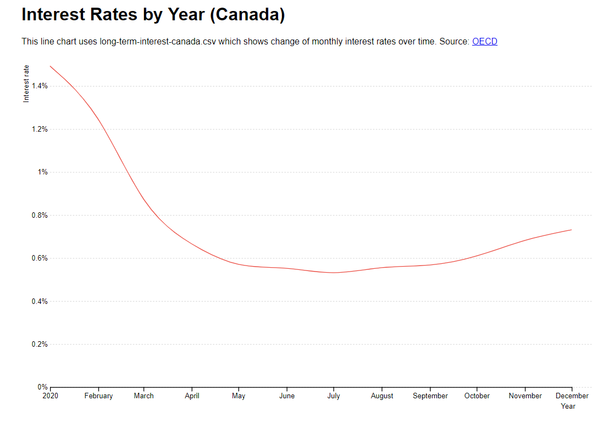

# Line, multiline, and area charts using D3

## Line
This week I learned how to create a covid chart using D3 in the index.html and script.js files. Then I did another chart using libraries visits in the homework.html and the homework.js files. This is how it looks:

