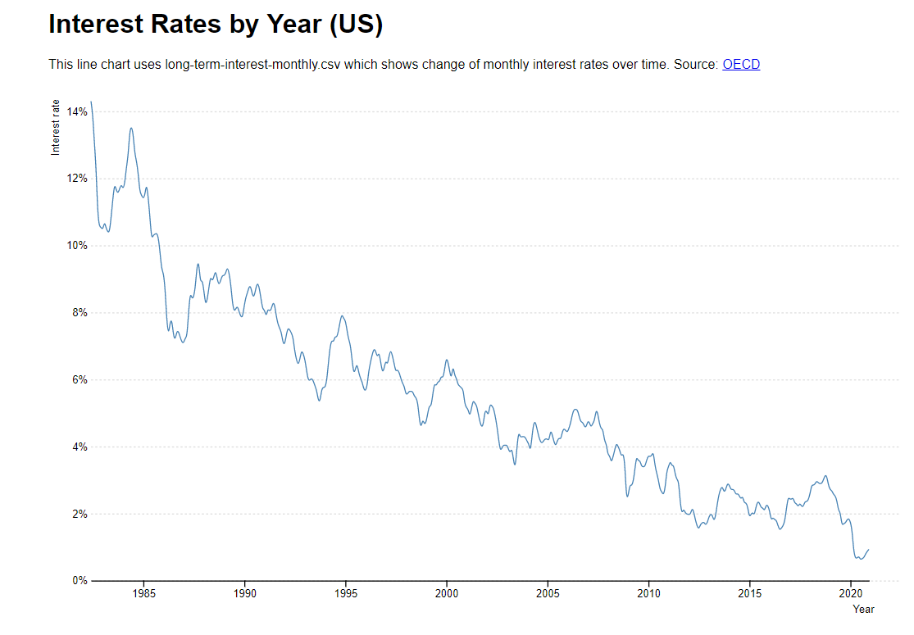
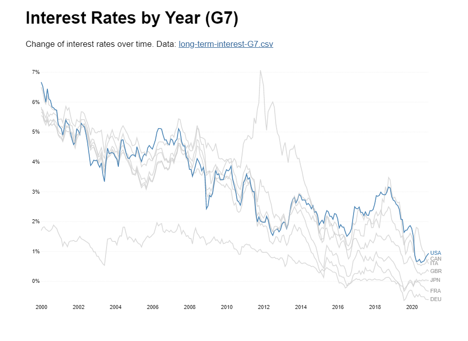
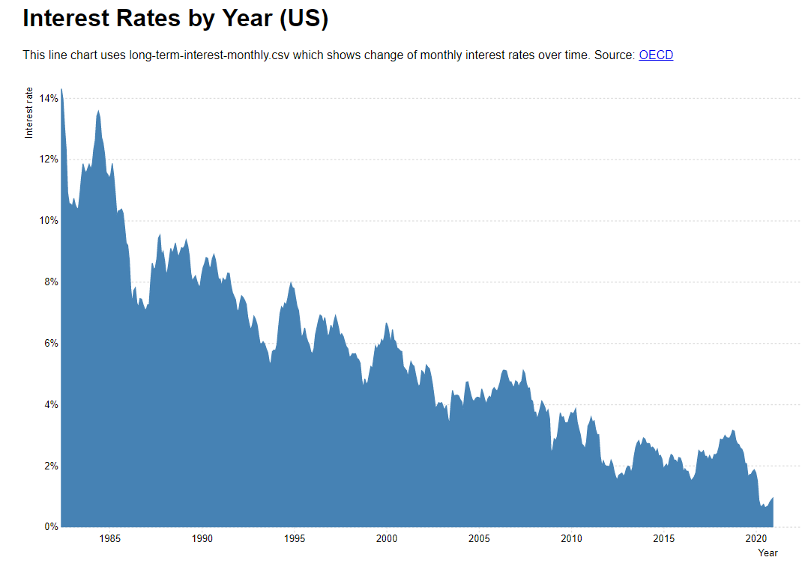
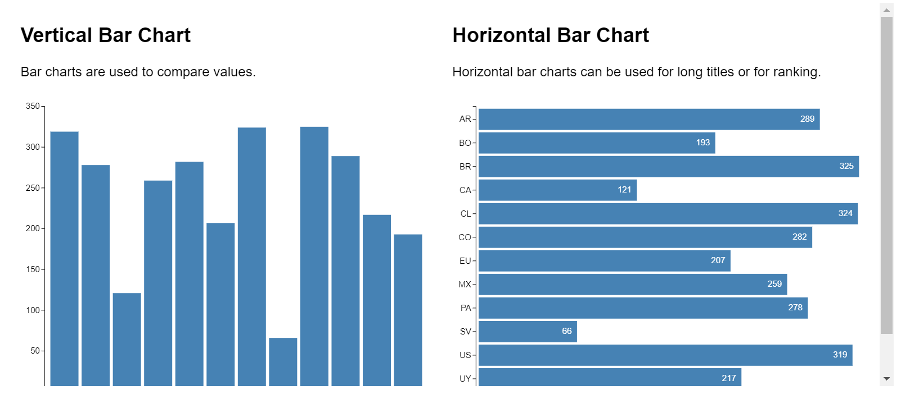

# Line, multiline, area, and horizontal-bar charts using D3

This week we learned how to plot these type of charts and did a line chart for homework.

## [Line chart - Homework](https://rodslzr.github.io/CAPP30239_FA22/week_04/homework.html)
Title: Interest Rates by Year (Canada)
Data: [long-term-interest-canada.csv](long-term-interest-canada.csv)
Code: [homework.html](homework.html), [homework.js](homework.js)

## [Line chart](https://rodslzr.github.io/CAPP30239_FA22/week_04/line.html)
Title: Interest Rates by Year (US)
Data: [long-term-interest-monthly.csv](long-term-interest-monthly.csv)
Code: [line.html](line.html), [line.js](line.js) 

## [Multiline chart](https://rodslzr.github.io/CAPP30239_FA22/week_04/multiline.html)
Title: Interest Rates by Year (G7)
Data: [long-term-interest-G7.csv](long-term-interest-G7.csv)
Code: [multiline.html](multiline.html), [multiline.js](multiline.js) 

## [Area chart](https://rodslzr.github.io/CAPP30239_FA22/week_04/area.html)
Title: Interest Rates by Year (US)
Data: [long-term-interest-monthly.csv](long-term-interest-monthly.csv)
Code: [area.html](area.html), [area.js](area.js)

## [Horizontal-bar chart](https://rodslzr.github.io/CAPP30239_FA22/week_04/horizontal-bar.html)
Title: Vertical Bar Chart / Horizontal Bar Chart
Data: [covid.csv](covid.csv)
Code: [horizontal-bar.html](horizontal-bar.html), [horizontal-bar.js](horizontal-bar.js) 

